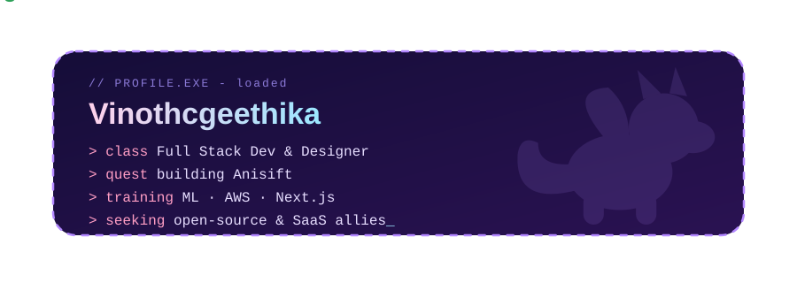

  

  

  

  
  
  
  

---

## 🌸 Quest Log

- 🔭 Currently working on **[Anisift](https://anishift.netlify.app/)**
- 🌱 Currently learning **Machine Learning, AWS or Next.js**
- 👯 Looking to collaborate on **Open-source Python bots, SaaS projects or Automation tools**
- 🤝 Looking for help with **Scaling SaaS applications or Advanced UI/UX design**
- 💬 Ask me about **Python Automation, Web Development, SaaS Architecture and Graphic Design**
- 📝 I write articles at **[vinothgeethika.netlify.app/writing](https://vinothgeethika.netlify.app/writing)**
- 📫 Reach me at **vinothgeethika232@gmail.com**
- ⚡ Fun fact: **I automate everything except my life 🤖**

---

## ⚔️ Languages & Tools

  &nbsp;
  &nbsp;
  &nbsp;
  &nbsp;
  &nbsp;
  &nbsp;
  &nbsp;
  &nbsp;
  &nbsp;
  &nbsp;
  &nbsp;
  &nbsp;
  &nbsp;
  &nbsp;

---

  

