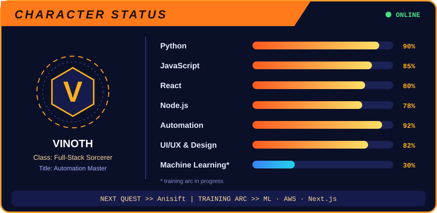

  

  

  

  
  
  
  

---

## 🔥 Current Missions

- 🔭 **Main quest:** building **[Anisift](https://anishift.netlify.app/)**
- 🌱 **Training arc:** Machine Learning, AWS and Next.js
- 👯 **Recruiting allies:** open-source Python bots, SaaS projects and automation tools
- 🤝 **Need backup with:** scaling SaaS apps and advanced UI/UX design
- 💬 **Ask me about:** Python Automation, Web Development, SaaS Architecture and Graphic Design
- 📝 **Battle journal:** [vinothgeethika.netlify.app/writing](https://vinothgeethika.netlify.app/writing)
- 📫 **Summon me:** vinothgeethika232@gmail.com
- ⚡ **Secret technique:** I automate everything except my life 🤖

---

## 🗡️ Arsenal

  &nbsp;
  &nbsp;
  &nbsp;
  &nbsp;
  &nbsp;
  &nbsp;
  &nbsp;
  &nbsp;
  &nbsp;
  &nbsp;
  &nbsp;
  &nbsp;
  &nbsp;
  &nbsp;

---

  

